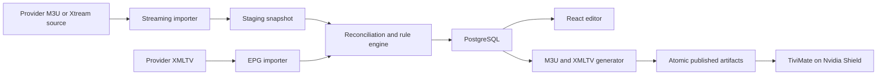

# IPTVMaster Execution Plan

Status: implementation in progress
Scope: personal, self-hosted IPTV playlist and EPG editor for TiviMate  
Primary deployment target: Proxmox VE on an i7-3770K host with 16 GB RAM

## 1. Product goal

Build a local web application that:

- Imports an upstream IPTV playlist and its XMLTV EPG.
- Focuses on live TV and daily live-event groups for the first release.
- Preserves channel edits when the provider refreshes or replaces streams.
- Treats daily events as transient entries rather than permanent channels.
- Converts event start times from `Europe/Stockholm` to `Europe/Helsinki` only in selected event groups.
- Publishes stable M3U and XMLTV URLs for TiviMate.
- Updates automatically, retains a last-known-good output, and reports changes.
- Keeps subscription credentials out of Git, logs, backups, and the user interface after initial entry.
- Runs locally without relaying or transcoding video.

## 2. Decisions for the first release

These are the recommended defaults. They can be changed before implementation begins.

| Area             | MVP decision                                                                                        |
| ---------------- | --------------------------------------------------------------------------------------------------- |
| Content          | Import and edit live TV only; skip VOD and series                                                   |
| Daily events     | Transient snapshot model with persistent group-level rules                                          |
| Event timezone   | Source `Europe/Stockholm`, output `Europe/Helsinki`, configurable per group                         |
| Output           | M3U plus XMLTV endpoints for TiviMate                                                               |
| Stream transport | Direct provider URLs initially; optional local HTTP redirect mode after a Shield compatibility test |
| Backend          | TypeScript with Fastify and streaming M3U/XMLTV parsers                                             |
| Frontend         | React and TypeScript                                                                                |
| Database         | PostgreSQL, avoiding later migration pressure from large EPG datasets                               |
| Jobs             | One database-backed scheduler/worker; no Redis in the MVP                                           |
| Packaging        | Docker images and Docker Compose                                                                    |
| Proxmox target   | Small Debian VM rather than Docker inside LXC                                                       |
| Access           | LAN-only, single administrator account, token-protected playlist endpoints                          |
| Repository       | Private GitHub repository with no provider data or credentials committed                            |

## 3. Architecture



The server is not in the video data path. TiviMate receives the current upstream stream URL, or a lightweight local redirect if that mode proves compatible. Playback traffic continues directly between the Shield and the provider.

## 4. Core data model

The schema should distinguish stable user intent from disposable provider snapshots.

### Source configuration

- Provider name and enabled state
- M3U or Xtream connection details
- XMLTV connection details
- Refresh schedules
- Default provider and display timezones
- Secret references rather than credentials in ordinary application rows

### Source snapshot

- Import timestamp and outcome
- Content fingerprint
- Number of live, VOD, malformed, added, removed, and changed entries
- Raw provider identifiers and metadata
- Snapshot retention and last-known-good status

The raw playlist does not need long-term retention. Parsed metadata and a compact audit diff are sufficient.

### Permanent channel

- Stable internal UUID
- Current provider item association
- Original and custom names
- Original and custom groups
- Enabled, hidden, order, logo, and EPG settings
- Matching confidence and manual lock state

### Event entry

- Snapshot-scoped identity
- Provider stream identifier and original name
- Parsed event date and start time
- Source timezone, UTC instant, and display timezone
- Generated localized name
- Placeholder and availability state

Event records disappear from published output when they disappear from a successful source snapshot. A short audit history can be retained without treating them as permanent channels.

### Group policy

- Permanent-channel or transient-event behavior
- Include/exclude state and output group name
- Placeholder filters
- Time parsing and timezone conversion policy
- Sorting policy
- Optional per-group update frequency

### EPG model

- Imported XMLTV channels
- Programmes stored with UTC start and stop instants
- Duplicate-ID detection
- Channel-to-EPG mappings with manual locks
- Mapping confidence and provenance

### Output profile

- Published channel/group selection
- Ordering
- M3U and XMLTV access token
- Last successful artifact version
- Optional future profiles for different TiviMate devices

## 5. Reconciliation rules

### Permanent live TV

Match using a weighted set of signals rather than a single field:

1. Provider stream/channel ID when it remains stable.
2. Non-empty `tvg-id`.
3. Normalized channel name.
4. Provider group, logo, and previous URL fingerprint.
5. A manually locked match, which automatic matching must not override.

Low-confidence matches enter a review queue. The system must not silently transfer edits to an unrelated channel.

### Daily live events

- Selected groups are configured as transient event groups.
- The latest successful snapshot replaces the previously published group contents.
- Customization is attached primarily to the group policy, not individual events.
- Known placeholders are hidden through editable case-insensitive patterns.
- The original provider name is always retained for troubleshooting.
- Stale events are removed from output after a valid refresh but remain briefly in audit history.
- An invalid or incomplete download must not erase the current working event list.

### Event time conversion

The parser should recognize at least:

- `17:00 Event name`
- `17.00 Event name`
- Date fragments such as `8/4`
- Full provider date/time labels where present

Processing sequence:

1. Parse the event's local date and time using the configured source timezone.
2. Convert it to a UTC instant.
3. Convert UTC to the selected display timezone.
4. Rewrite only the parsed time/date portion of the generated display name.
5. Preserve punctuation and the remainder of the title.
6. Update the date when conversion crosses midnight.

The implementation must use IANA timezone names, not a hard-coded `+1`, so DST and future timezone rules remain correct. Permanent live-TV channel names and EPG times are not modified by this event-title rule.

## 6. Delivery phases

Each phase has a completion gate. Work should not advance past a failed gate without resolving or explicitly deferring it.

### Phase 0 — Discovery and safe fixtures

Tasks:

- Confirm the event groups that should be enabled initially.
- Capture two provider snapshots on different days to observe which IDs, names, and slots change.
- Sanitize the fixtures by replacing hostnames, credentials, stream IDs, and unnecessary copyrighted metadata.
- Check whether the account exposes a usable Xtream API for live-only retrieval.
- Verify the actual source timezone for each enabled event group.
- Record TiviMate refresh behavior and whether it follows HTTP redirects reliably.

Gate:

- The repository contains small synthetic/sanitized M3U and XMLTV fixtures.
- No real credential, provider URL, or playable stream is present.
- At least one permanent-channel change and one next-day event replacement are represented.

Estimated effort: 0.5–1 day, excluding the wait between daily snapshots.

### Phase 1 — GitHub and project foundation

Tasks:

- Initialize Git locally with `main` as the default branch.
- Create a private GitHub repository named `IPTVMaster`.
- Add a strict `.gitignore`, `.env.example`, README, architecture record, security notes, and development instructions.
- Create the TypeScript monorepo for API, worker, web UI, and shared packages.
- Add formatting, linting, type checking, unit tests, and build commands.
- Add Dockerfiles and a development Docker Compose stack.
- Add database migrations and seed only synthetic test data.
- Add GitHub Actions for lint, type check, test, build, and container build verification.
- Enable dependency update and vulnerability alerts supported by the private repository.

Gate:

- A clean checkout can be started using documented commands.
- CI passes on `main`.
- Secret scanning of the tracked tree finds no provider credential or URL.

Estimated effort: 1–2 days.

### Phase 2 — Source ingestion

Tasks:

- Implement encrypted/redacted source configuration.
- Add generic M3U and XMLTV source adapters.
- Add an Xtream live-source adapter if the Phase 0 check succeeds.
- Parse M3U and XMLTV incrementally without loading entire files into memory.
- Classify live versus VOD/series entries and skip non-live content by default.
- Validate response type, size, encoding, minimum entry counts, and parse-error thresholds.
- Store staging snapshots and import statistics.
- Ensure logs redact query strings, credentials, and stream paths.

Gate:

- The known large source can be processed on target-like hardware without unbounded memory use.
- A malformed, empty, HTML, or interrupted response does not replace working data.
- VOD/series records are not imported into the MVP database.

Performance target:

- Process a roughly 62 MB combined playlist in under five minutes and below 1 GB peak application memory on the deployment VM. The target can be tightened after measuring.

Estimated effort: 2–4 days.

### Phase 3 — Permanent-channel reconciliation and editing

Tasks:

- Implement normalized names and weighted matching.
- Preserve edits across stream URL, ordering, and provider-name changes.
- Add manual match locking and unresolved-change review.
- Implement hide, rename, regroup, reorder, logo override, and bulk rules.
- Add snapshot comparison and rollback metadata.

Gate:

- Re-importing a changed fixture preserves all intended edits.
- Ambiguous matches are surfaced instead of applied silently.
- Provider removals and additions are visible in an audit view.

Estimated effort: 3–5 days.

### Phase 4 — Daily event engine and timezone localization

Tasks:

- Add the event-group classification and group-policy editor.
- Implement placeholder detection with editable patterns.
- Implement time/date parsing for observed provider formats.
- Convert `Europe/Stockholm` to `Europe/Helsinki` by default for selected event groups.
- Sort events by their calculated local start instant.
- Handle midnight date rollover, missing dates, ambiguous text, and invalid times.
- Show original and localized names side by side in the review UI.
- Optionally generate synthetic programme records from reliably parsed event times.

Gate:

- `17:00` Swedish time is emitted as `18:00` Finnish time for an ordinary test date.
- DST-boundary tests use timezone rules correctly.
- An event crossing midnight receives the correct Finnish date.
- No permanent live-TV entry is renamed or time-shifted.
- Unparseable event names remain usable and are visibly flagged.

Estimated effort: 2–4 days.

### Phase 5 — Web editor

Tasks:

- Add single-administrator authentication and initial setup flow.
- Build dashboard, channels, live events, group rules, EPG mappings, updates, and settings pages.
- Support search, filtering, pagination/virtualized lists, bulk editing, and drag ordering.
- Add change previews before publishing.
- Clearly separate original provider data from user overrides.
- Ensure raw secrets and complete stream URLs are never rendered after save.

Gate:

- Thousands of live entries remain responsive in the browser.
- The complete editing workflow works without database or command-line access.
- User changes are auditable and reversible.

Estimated effort: 4–7 days.

### Phase 6 — M3U/XMLTV publishing and TiviMate validation

Tasks:

- Generate standards-compatible M3U and XMLTV artifacts.
- Publish artifacts atomically and retain the previous successful version.
- Add random revocable output tokens.
- Implement cache headers and conditional requests suitable for TiviMate refreshes.
- Validate generated XML and playlist entry pairing.
- Test direct provider URLs on the Nvidia Shield.
- Prototype stable local HTTP redirects and enable only if TiviMate handles them reliably.
- Document adding the playlist and EPG URLs to TiviMate.

Gate:

- TiviMate imports the playlist and guide without manual file copying.
- A provider refresh is reflected after TiviMate updates its playlist.
- Playback traffic does not pass through IPTVMaster.
- Revoking an output token blocks the old local playlist URL.

Estimated effort: 2–4 days.

### Phase 7 — EPG reconciliation

Tasks:

- Import XMLTV channels/programmes incrementally.
- Detect duplicate and empty IDs.
- Match channels using ID, normalized name, and manual mapping.
- Prevent duplicate provider IDs from producing ambiguous generated XMLTV channels.
- Add missing-EPG and ambiguous-mapping reports.
- Apply retention limits to past and future programme rows.
- Merge synthetic event programmes only when their parsed time is reliable.

Gate:

- Generated XMLTV passes validation.
- Manual EPG mappings survive upstream refreshes.
- Duplicate upstream IDs cannot silently attach the wrong guide to a channel.

Estimated effort: 3–5 days.

### Phase 8 — Scheduling, resilience, security, and backup

Tasks:

- Add configurable schedules with initial defaults:
  - live/event source every 60–120 minutes;
  - XMLTV every 6–12 hours;
  - cleanup and backup daily.
- Prevent overlapping imports.
- Add retries with backoff and provider-friendly request limits.
- Add health/readiness endpoints and actionable update logs.
- Add database backup, retention, restore tooling, and a restore test.
- Add CSRF protection, secure session cookies, login rate limiting, and security headers.
- Keep the service LAN-only and document firewall expectations.
- Add release versioning and rollback instructions.

Gate:

- A failed refresh retains the last-known-good M3U/XMLTV output.
- An interrupted job can recover on restart.
- A backup can be restored into a clean stack.
- Logs contain no credentials or unredacted upstream URLs.

Estimated effort: 3–5 days.

### Phase 9 — Proxmox production installation

Recommended VM allocation:

- 2 virtual CPU cores
- 4 GB RAM initially
- 32 GB virtual disk initially, with monitoring before increasing it
- VirtIO network and disk devices
- QEMU guest agent
- Static DHCP reservation
- A stable LAN address or local DNS entry, preferably under `home.arpa`

Installation tasks:

1. Create a minimal supported Debian VM from a verified installation image.
2. Apply operating-system updates and configure time synchronization for `Europe/Helsinki`.
3. Create a non-root administrative user with SSH keys.
4. Install Docker Engine and the Compose plugin from the official Docker repository.
5. Create `/opt/iptvmaster` and dedicated persistent data/backup locations.
6. Deploy a pinned release using Docker Compose rather than a floating `latest` tag.
7. Store production secrets in a root-readable environment/secret file that is excluded from Git.
8. Configure PostgreSQL, application, worker, and optional reverse-proxy containers with health checks.
9. Restrict inbound access to the trusted LAN; do not expose the application or playlist endpoints to the public internet.
10. Configure the application source, event groups, timezones, and output profile through the setup UI.
11. Add the generated M3U/XMLTV URLs to TiviMate and perform playback/refresh tests.
12. Configure daily application backups and Proxmox VM backups to storage outside the VM disk.
13. Perform and document one restore and one application rollback.

Gate:

- The application survives a VM reboot without manual intervention.
- Scheduled imports execute in Finnish local time while stored timestamps remain UTC.
- TiviMate can update and play selected channels from the production instance.
- A Proxmox backup and an application-level database backup both exist.

Estimated effort: 1 day after an MVP release image is ready.

### Phase 10 — Home beta and stabilization

Tasks:

- Run the app alongside the current IPTVEditor workflow for at least seven days.
- Compare daily Finnish event groups and ordinary channel edits.
- Record false matches, time parsing misses, provider outages, and TiviMate refresh behavior.
- Fix critical issues before making IPTVMaster the primary playlist source.
- Tag the first stable release only after a backup/restore rehearsal.

Gate:

- Seven consecutive days without lost edits or stale event groups.
- Time conversion is correct for every selected event group.
- The current workflow can be restored quickly if the local service is unavailable.

Estimated effort: 7 calendar days of observation plus fixes.

## 7. Testing strategy

### Automated tests

- M3U attribute and malformed-line parsing
- XMLTV streaming import
- Credential and URL redaction
- Live/VOD classification
- Permanent-channel matching and ambiguity thresholds
- Event placeholder filtering
- Stockholm-to-Helsinki conversion
- DST and midnight rollover
- Atomic publishing and last-known-good fallback
- Duplicate EPG IDs and manual mapping locks
- Database migrations and backup restoration
- API authorization and output token revocation

### Integration tests

- Import two sanitized daily snapshots and verify their diff.
- Generate M3U/XMLTV and reparse the generated artifacts.
- Simulate partial downloads, provider HTML error pages, empty groups, and database restart.
- Run performance tests with a synthetic playlist matching the observed entry count.

### Manual device tests

- Add source to TiviMate on the Nvidia Shield Pro.
- Refresh playlist and EPG independently.
- Open permanent channels and daily event streams.
- Verify localized event names and date rollover.
- Verify direct playback and optional redirect behavior.
- Reboot the Shield, VM, and Proxmox host separately.

## 8. GitHub safety and workflow

The GitHub repository should be private, but the project must still assume that tracked files could eventually become public.

Required safeguards:

- Never commit `.env`, real M3U/XMLTV downloads, database dumps, logs, screenshots containing URLs, or playable fixtures.
- Use synthetic fixtures and `.example` configuration files.
- Add a pre-commit or CI secret scan before the first provider configuration is used locally.
- Use short feature branches and pull requests, even for a single developer, once the foundation is stable.
- Require passing CI before merging to `main`.
- Tag releases and pin the Proxmox deployment to a release tag.
- Publish release images to GitHub Container Registry only if private package access is configured safely; otherwise build the pinned release on the VM.
- Use a read-only deploy key or narrowly scoped token for production checkout/pulls.
- Keep provider credentials in the production application's secret store only, never in GitHub Actions secrets unless a later test explicitly requires them.

Suggested initial repository files:

```text
IPTVMaster/
├── apps/
│   ├── api/
│   ├── worker/
│   └── web/
├── packages/
│   ├── database/
│   ├── playlist/
│   ├── epg/
│   └── shared/
├── fixtures/
│   └── synthetic/
├── deploy/
│   └── compose/
├── docs/
├── .github/workflows/
├── .env.example
├── compose.yaml
└── README.md
```

## 9. Operations after installation

### Daily

- Automatic source and EPG refreshes
- Last-known-good publication
- Database backup
- Failed-job notification in the dashboard

### Weekly

- Review unmatched permanent channels and unparsed events
- Verify backup completion and available disk space

### Before an upgrade

- Create an application backup.
- Create or verify a recent Proxmox VM backup.
- Record the running image/release tag.
- Pull/build the new pinned release and run migrations.
- Check health, import, publication, and one TiviMate stream.
- Roll back to the prior tag if the acceptance check fails.

## 10. Explicitly deferred features

These are outside the first release unless needed to make the MVP usable:

- VOD and series management
- Multi-user permissions
- Multiple provider merging
- Mobile-native applications
- Video proxying, transcoding, recording, or timeshifting
- Public internet exposure
- Full Xtream-compatible server emulation
- Automatic logo scraping
- Home Assistant integration
- Advanced notification integrations

## 11. Overall estimate and execution order

A realistic first stable version is approximately 3–5 focused developer-weeks, or 4–8 weeks of evening/weekend work, followed by the seven-day home beta. Actual duration depends most on EPG cleanup, the editor UX, and the variability observed between provider snapshots.

Execution order:

1. Approve this plan and the MVP decisions.
2. Initialize the private GitHub repository and project foundation.
3. Capture sanitized two-day fixtures and validate the live-only source path.
4. Build ingestion and snapshot safety before any editor UI.
5. Build permanent reconciliation and daily-event timezone handling.
6. Build the web editor and TiviMate outputs.
7. Complete EPG reconciliation, resilience, security, and restore testing.
8. Produce a pinned release and install it on Proxmox.
9. Run the parallel seven-day home beta.

## 12. Approval checkpoint

Before implementation starts, confirm or adjust these three choices:

1. Private GitHub repository named `IPTVMaster`.
2. Live TV and daily events only for the MVP; VOD/series deferred.
3. Debian VM with Docker Compose on Proxmox, using 2 vCPU, 4 GB RAM, and 32 GB disk initially.

No provider URL or credential should be pasted into source files, GitHub issues, commits, or pull requests. It will be entered later through the local setup UI or production secret configuration.
